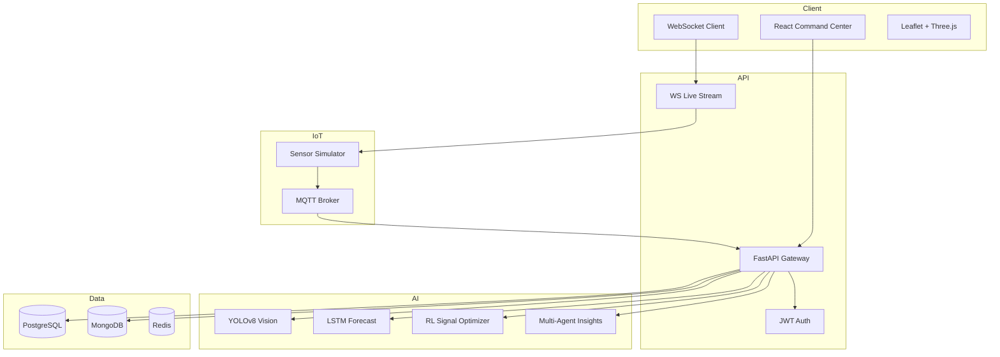

# NEXUS Architecture

## System Overview

## Data Flow

1. **IoT Simulator** publishes sensor readings to MQTT (or backend internal simulator).
2. **City Simulator** fuses telemetry into a unified digital twin snapshot every 2s.
3. **WebSocket** pushes snapshots to all connected command center clients.
4. **AI modules** enrich snapshots with predictions, CV detections, and RL optimizations.
5. **PostgreSQL** stores historical readings; **MongoDB** stores CV detections and AI reports.

## Security

- JWT bearer tokens with role-based access (admin, operator, analyst)
- CORS restricted in production via environment config
- Secrets via `.env` — never commit credentials

## Deployment

- **Development:** Uvicorn + Vite dev servers
- **Docker Compose:** Full stack with Postgres, MongoDB, Redis, MQTT, Nginx
- **Kubernetes:** Horizontal pod autoscaling for backend/frontend (`docker/kubernetes/`)
